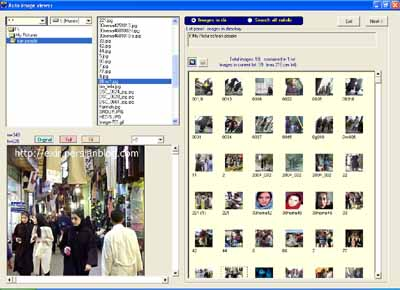



## Simple ACD See

### Description

This program is written in Visual Basic environment and uses the windows API function and has the capabilities of showing preview of images in thumbnail and full screen, editing of image brightness contrast, cropping image in standard formats and prepare it to the printer.
 
### More Info
 

             |
---                |---
**Submitted On**   |2005-07-05 12:58:00
**By**             |[Ahmad Kolahi](https://github.com/Planet-Source-Code/PSCIndex/blob/master/ByAuthor/ahmad-kolahi.md)
**Level**          |Advanced
**User Rating**    |3.8 (15 globes from 4 users)
**Compatibility**  |VB 6\.0
**Category**       |[Complete Applications](https://github.com/Planet-Source-Code/PSCIndex/blob/master/ByCategory/complete-applications__1-27.md)
**World**          |[Visual Basic](https://github.com/Planet-Source-Code/PSCIndex/blob/master/ByWorld/visual-basic.md)
**Archive File**   |[Simple\_ACD192008822005\.zip](https://github.com/Planet-Source-Code/ahmad-kolahi-simple-acd-see__1-62036/archive/master.zip)

